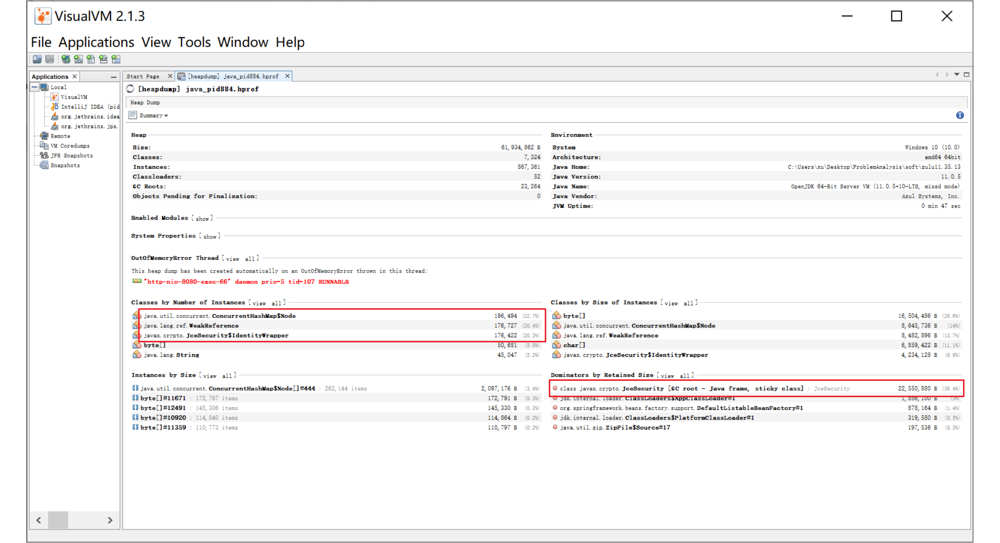
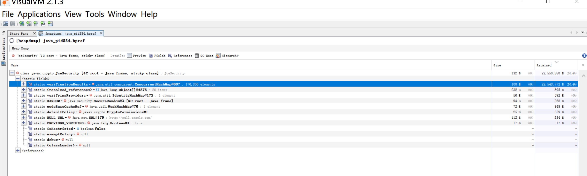
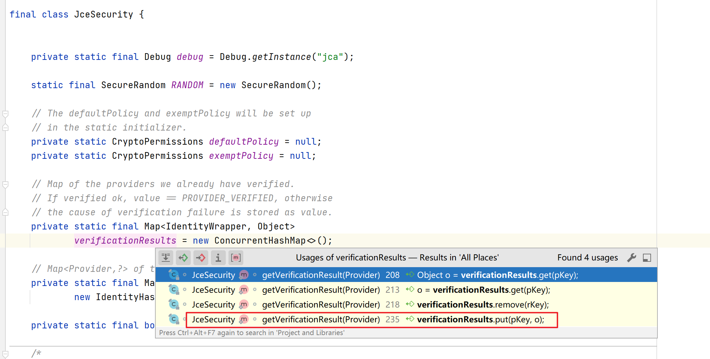
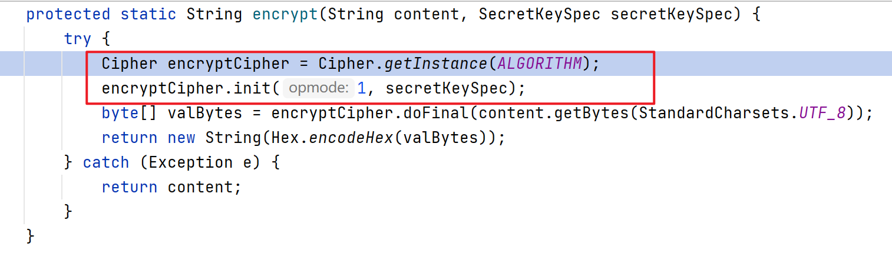

# zulu jdk memory leak

```
zulu jdk version: 11.35.13
```

下载链接


#### 启动命令

```shell
-Xms50m -Xmx50m -XX:+HeapDumpOnOutOfMemoryError
```

 使用Jmeter进行压测，直到oom，得到堆转储文件。


### 分析

使用visualvm 分析堆转储文件。



分析可得 javax.crypto.JceSecurity 类 数据异常。 

  尤其是 verificationResults 占据了绝大部分的内存。这个包是和 加密相关的。



### 原因分析



因为 verificationResults 这个属性是 静态的，那么他可以做为GC Root。 而这个属性是个map,并且在程序执行中，在不断的扩张，又因为他是GC Root 所以他不会被回收，他的直接引用也不会被GC 回收。

幸运的是，在调用中只有一个地方在对该map 进行put，所以在那个方法上加个断点，看下栈调用，具体是由那一步引起的。

------

### 栈调用记录

```
getVerificationResult:207, JceSecurity (javax.crypto)
canUseProvider:248, JceSecurity (javax.crypto)
getInstance:540, Cipher (javax.crypto)
encrypt:28, AesUtils (com.paimonx.zulu.util)
encrypt:23, AesUtils (com.paimonx.zulu.util)
demo:24, DemoController (com.paimonx.zulu.controller)
invoke0:-1, NativeMethodAccessorImpl (jdk.internal.reflect)
invoke:62, NativeMethodAccessorImpl (jdk.internal.reflect)
invoke:43, DelegatingMethodAccessorImpl (jdk.internal.reflect)
invoke:566, Method (java.lang.reflect)
doInvoke:190, InvocableHandlerMethod (org.springframework.web.method.support)
invokeForRequest:138, InvocableHandlerMethod (org.springframework.web.method.support)
invokeAndHandle:105, ServletInvocableHandlerMethod (org.springframework.web.servlet.mvc.method.annotation)
invokeHandlerMethod:892, RequestMappingHandlerAdapter (org.springframework.web.servlet.mvc.method.annotation)
handleInternal:797, RequestMappingHandlerAdapter (org.springframework.web.servlet.mvc.method.annotation)
handle:87, AbstractHandlerMethodAdapter (org.springframework.web.servlet.mvc.method)
doDispatch:1040, DispatcherServlet (org.springframework.web.servlet)
doService:943, DispatcherServlet (org.springframework.web.servlet)
processRequest:1006, FrameworkServlet (org.springframework.web.servlet)
doGet:898, FrameworkServlet (org.springframework.web.servlet)
service:626, HttpServlet (javax.servlet.http)
service:883, FrameworkServlet (org.springframework.web.servlet)
service:733, HttpServlet (javax.servlet.http)
internalDoFilter:231, ApplicationFilterChain (org.apache.catalina.core)
doFilter:166, ApplicationFilterChain (org.apache.catalina.core)
doFilter:53, WsFilter (org.apache.tomcat.websocket.server)
internalDoFilter:193, ApplicationFilterChain (org.apache.catalina.core)
doFilter:166, ApplicationFilterChain (org.apache.catalina.core)
doFilterInternal:100, RequestContextFilter (org.springframework.web.filter)
doFilter:119, OncePerRequestFilter (org.springframework.web.filter)
internalDoFilter:193, ApplicationFilterChain (org.apache.catalina.core)
doFilter:166, ApplicationFilterChain (org.apache.catalina.core)
doFilterInternal:93, FormContentFilter (org.springframework.web.filter)
doFilter:119, OncePerRequestFilter (org.springframework.web.filter)
internalDoFilter:193, ApplicationFilterChain (org.apache.catalina.core)
doFilter:166, ApplicationFilterChain (org.apache.catalina.core)
doFilterInternal:94, HiddenHttpMethodFilter (org.springframework.web.filter)
doFilter:119, OncePerRequestFilter (org.springframework.web.filter)
internalDoFilter:193, ApplicationFilterChain (org.apache.catalina.core)
doFilter:166, ApplicationFilterChain (org.apache.catalina.core)
doFilterInternal:201, CharacterEncodingFilter (org.springframework.web.filter)
doFilter:119, OncePerRequestFilter (org.springframework.web.filter)
internalDoFilter:193, ApplicationFilterChain (org.apache.catalina.core)
doFilter:166, ApplicationFilterChain (org.apache.catalina.core)
invoke:202, StandardWrapperValve (org.apache.catalina.core)
invoke:97, StandardContextValve (org.apache.catalina.core)
invoke:542, AuthenticatorBase (org.apache.catalina.authenticator)
invoke:143, StandardHostValve (org.apache.catalina.core)
invoke:92, ErrorReportValve (org.apache.catalina.valves)
invoke:78, StandardEngineValve (org.apache.catalina.core)
service:343, CoyoteAdapter (org.apache.catalina.connector)
service:374, Http11Processor (org.apache.coyote.http11)
process:65, AbstractProcessorLight (org.apache.coyote)
process:868, AbstractProtocol$ConnectionHandler (org.apache.coyote)
doRun:1590, NioEndpoint$SocketProcessor (org.apache.tomcat.util.net)
run:49, SocketProcessorBase (org.apache.tomcat.util.net)
runWorker:1128, ThreadPoolExecutor (java.util.concurrent)
run:628, ThreadPoolExecutor$Worker (java.util.concurrent)
run:61, TaskThread$WrappingRunnable (org.apache.tomcat.util.threads)
run:834, Thread (java.lang)
```

发现这两个方法都会调用  javax.crypto.JceSecurity#getVerificationResult 方法。



也就是说 一次加密会调用2次，通过visualvm 观察其中元素数量，发现是符合2倍规律的，所以问题就是有加密触发的。

### 但是这个map为什么会无限制扩张呢？map 中的元素又都是什么呢？


分析发现 map 中的值都是 javax.crypto.JceSecurity.IdentityWrapper 的实例，但是又能看到最内部的实例 都是 SunJce 的 同一个实例。

#### 源码分析

```java
   /*
     * Verify that the provider JAR files are signed properly, which
     * means the signer's certificate can be traced back to a
     * JCE trusted CA.
     * Return null if ok, failure Exception if verification failed.
     */
    static Exception getVerificationResult(Provider p) {   // p 就是SunJce 实例
        IdentityWrapper pKey = new IdentityWrapper(p);     // 构建一个内部类对象
        Object o = verificationResults.get(pKey);          // pkey 作为key 从验证结果中获取 
        // no mapping found
        if (o == null) {
            synchronized (JceSecurity.class) {              // DCL判断 
                // check cache again in case the result is now available
                o = verificationResults.get(pKey);
                if (o == null) {
                    // clean verificationResults
                    IdentityWrapper rKey;
                    while((rKey = IdentityWrapper.queue.poll())!= null) {
                        verificationResults.remove(rKey);
                    }
                    if (verifyingProviders.get(p) != null) {
                        // recursion; return failure now
                        return new NoSuchProviderException
                                ("Recursion during verification");
                    }
                    try {
                        verifyingProviders.put(p, Boolean.FALSE);
                        URL providerURL = getCodeBase(p.getClass());
                        verifyProvider(providerURL, p);
                        o = PROVIDER_VERIFIED;
                    } catch (Exception e) {
                        o = e;
                    } finally {
                        verifyingProviders.remove(p);
                    }
                    verificationResults.put(pKey, o);   // 把 验证完就把 pkey ：true/e 存起来 以便下次使用
                    if (debug != null) {
                        debug.println("Provider " + p.getName() +
                                " verification result: " + o);
                    }
                }
            }
        }
        return (o == PROVIDER_VERIFIED? null : (Exception) o);
    }
```

稍微理解下源码，可以知道 verificationResults 就是  缓存的作用， 对于javax.crypto.JceSecurity#getVerificationResult 方法来说就是 同一个入参 SunJce 实例 在  verificationResults 中应该存在唯一一个元素与其对应。

**而现在很明显不是这样的， 堆转储文件中 针对同一个 SunJce#1 存多个元素与其对应，并且还在以 每执行一次加密逻辑都增加2个元素的速度在增长。**从而导致了内存泄漏，以至最终oom。

**所以javax.crypto.JceSecurity.IdentityWrapper 这个内部类设计存在缺陷。**

```
 private static final class IdentityWrapper {
        static ConcurrentLinkedQueue<IdentityWrapper> queue =
                new ConcurrentLinkedQueue<IdentityWrapper>();
        final WeakReference<Provider> obj;

        IdentityWrapper(Provider obj) {
            this.obj = new WeakReference<Provider>(obj);
        }

        @Override
        public boolean equals(Object o) {
            Provider p = obj.get();
            if (p == null) {
                queue.add(this);
                return false;
            }

            if (this == o) {
                return true;
            }
            if (!(o instanceof IdentityWrapper)) {
                return false;
            }
            return p == ((IdentityWrapper)o).obj.get();
        }

        @Override
        public int hashCode() {
            return System.identityHashCode(obj);
        }

    }
```

**略读源码可以发现， equals(Object o) 方法 对比的是  弱引用所引用的对象的，即 SunJce#1 == SunJce#1。**

**但是hashCode() 返回的确是 弱引用的hash，通过构造器可以知道每次调用构造器都会生成一个新的弱引用，几乎是不会相同的。**

**ConcurrentHashMap 和 hashmap 的逻辑就是先比较hash,再比较equals。** 

**而现在相同的对象（SunJce#1） 没有相同的hash 所以会一直get 不到，所以会一直put 新的进来，从而导致内存泄漏。**

**所以hashCode()方法应该返回 SunJce#1 的hash。**

------

#### 解决方案

1. （建议）更换 JDK版本，这个问题发生在zulu 11.35.13 版本中，跟换小版本就能解决这个问题，（已验证 11.33.15，11.35.15不存在这样的问题。）

   在这个版本中 open jdk 对javax.crypto.JceSecurity#getVerificationResult 做个些优化，有原先的锁整个方法，换成了锁代码块。

   [7107615: scalability bloker in javax.crypto.JceSecurity · openjdk/jdk@74d45e4 (github.com)](https://github.com/openjdk/jdk/commit/74d45e481d1ad6aa5d7c6315ea86681e1a978ce0)

   zulu 在引入 这个优化的时候，又添加了一些自己的想法，比如 弱引用，故导致了这个内存泄漏的问题。

2.  如果因为一些原因不能更换JDK版本的话，由于这个类为java.base模块，默认修饰符，并且未对外暴露，可以尝试修改类字节码解决。将javax.crypto.JceSecurity.IdentityWrapper 修改成这样。


   我提供了一个agent 来使用这个方式来解决。
   

   
   ```shell
   -javaagent:{path}/patch-agent-1.0-SNAPSHOT-jar-with-dependencies.jar
   ```
   
   [hahhaahah]: ../patch-agent/target/patch-agent-1.0-SNAPSHOT-jar-with-dependencies.jar

```
    private static final class IdentityWrapper {
        static ConcurrentLinkedQueue<IdentityWrapper> queue =
                new ConcurrentLinkedQueue<IdentityWrapper>();
        final WeakReference<Provider> obj;
        // change
        final int hash;

        IdentityWrapper(Provider obj) {
            this.obj = new WeakReference<Provider>(obj);
            // change
            this.hash = System.identityHashCode(obj);
        }

        @Override
        public boolean equals(Object o) {
            Provider p = obj.get();
            if (p == null) {
                queue.add(this);
                return false;
            }

            if (this == o) {
                return true;
            }
            if (!(o instanceof IdentityWrapper)) {
                return false;
            }
            return p == ((IdentityWrapper)o).obj.get();
        }

        @Override
        public int hashCode() {
        	// change
            return this.hash;
        }

    }
```

